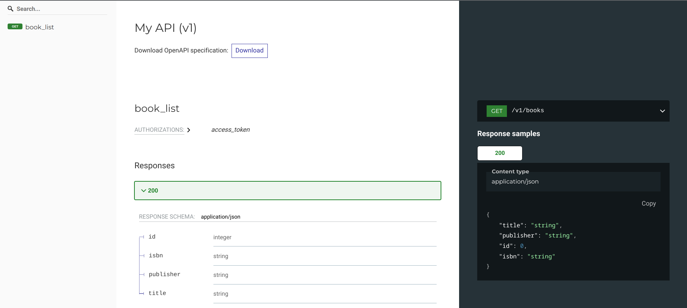

# Getting started

Let's install small example Flask app:

```
my_app
├── app.py
└── my_api.py
```

```sh
cd my_app
python -m venv .venv
source .venv/bin/activate
pip install flask-marshmallow-openapi
```

`my_api.py`:

```py
import flask
import marshmallow as ma
from flask_marshmallow_openapi import open_api


api = flask.Blueprint("my_api", __name__)


class BookSchema(ma.Schema):
    id = ma.fields.Integer(as_string=True)
    title = ma.fields.String(allow_none=False)
    publisher = ma.fields.String(allow_none=False)
    isbn = ma.fields.String(allow_none=False)


@open_api.get_list(response_schema=BookSchema)
@api.route("/books", methods=["GET"])
def books_list():
    return flask.jsonify(
        BookSchema(many=True).dump(
            [
                {"id": 24, "title": "title", "publisher": "publisher", "isbn": "isbn"},
                {"id": 42, "title": "title", "publisher": "publisher", "isbn": "isbn"},
            ]
        )
    )
```

`app.py`:

```py
from flask_marshmallow_openapi import OpenAPISettings, OpenAPI

import flask

from my_api import api

app = flask.Flask(__name__)
app.register_blueprint(api, url_prefix="/v1")


conf = OpenAPISettings(
    api_version="v1", api_name="My API", app_package_name="my_api", mounted_at="/v1"
)
docs = OpenAPI(config=conf)
docs.init_app(app)
```

Check routes:

```sh
$ flask routes

Endpoint               Methods  Rule
---------------------  -------  -------------------------------
my_api.books_list      GET      /v1/books
open_api.re_doc        GET      /v1/docs/re_doc
open_api.static        GET      /v1/docs/static/<path:filename>
open_api.swagger_json  GET      /v1/docs/static/swagger.json
open_api.swagger_ui    GET      /v1/docs/swagger_ui
open_api.swagger_yaml  GET      /v1/docs/static/swagger.yaml
static                 GET      /static/<path:filename>
```

Run the app:

```sh
flask run
```

And see the docs in [local ReDoc](http://127.0.0.1:5000/v1/docs/re_doc):



## Full example application

Many examples in this documentation had been collected into complete Flask
application that demonstrates everything documented here.

Download:

- [complete app.py](./example_app/app.py)
- [complete my_api.py](./example_app/my_api.py)
